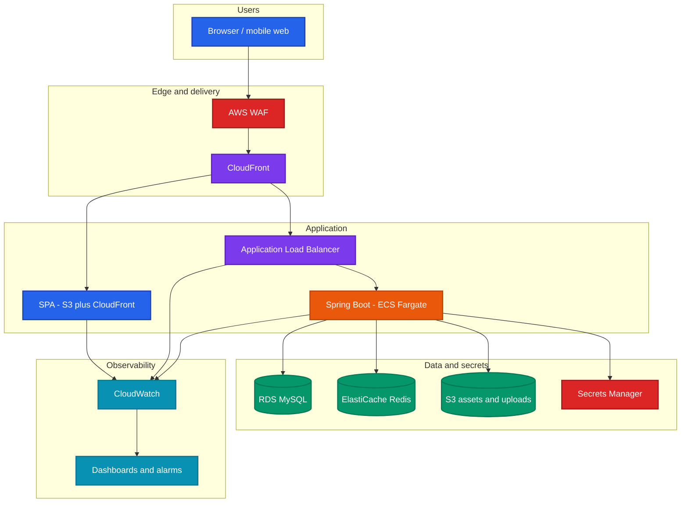
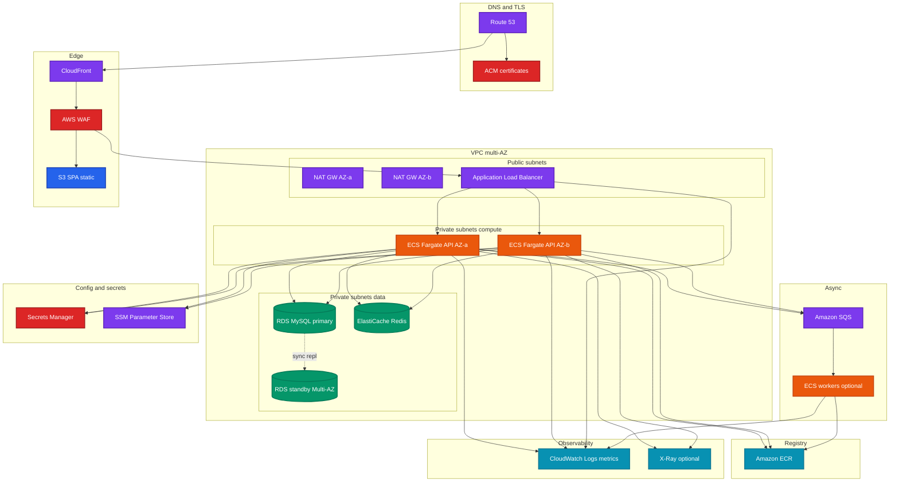
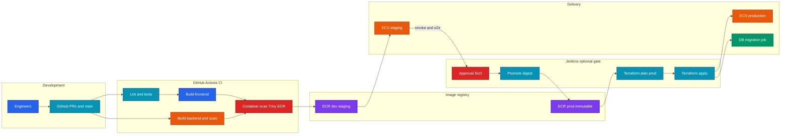
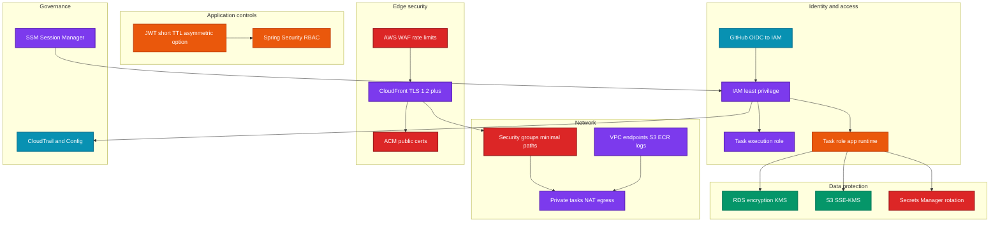
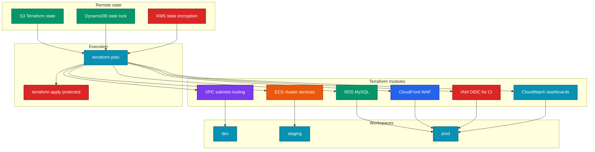

<div align="center">

# ExamWizards

**Online exams, courses, enrollments, and admin ops — Spring Boot API + React SPA**

[](LICENSE)
[](https://spring.io/projects/spring-boot)
[](https://openjdk.org/)
[](https://react.dev/)
[](https://www.docker.com/)

Backend-heavy · Docker-first · AWS-shaped · Terraform in-repo

[Architecture](#architecture) · [AWS topology](#aws-reference-topology) · [Infra](infra/README.md) · [Run locally](#local-development) · [License](#license)

</div>

ExamWizards is a role-based learning platform: instructors and admins manage courses and exams; students enroll, pay where needed, take timed assessments, and view results. The runtime is **Spring Boot + MySQL**, the client is **React (Vite)**, and workloads are packaged as **containers** with a production target on **AWS** (ECS Fargate, RDS, edge delivery, IaC under `infra/`).

> **Hosting:** Always-on public cloud was switched off after validation to save cost. The repo still reflects how you would ship it on AWS (Terraform, ECS task templates, CI). Demos can run via Docker Compose, lightweight Azure/Vercel previews, or a spare EC2 — pick what fits the budget.

---

## Stack

| Layer | Choices |
|-------|---------|
| API | Spring Boot 2.7, Java 17, Spring Security, JWT, JPA/Hibernate |
| UI | React 18, TypeScript, Vite, Tailwind, MUI, React Router 7 |
| Data | MySQL 8 (RDS-compatible); Flyway migrations in-repo; default config uses Hibernate `ddl-auto` — switch to managed migrations for prod |
| Integrations | Razorpay, Gmail SMTP, Google Gemini (`chatbot/` — Node service) |
| Containers | Multi-stage Dockerfiles, Compose, optional monolith `Dockerfile` |
| IaC | [`infra/aws/terraform`](infra/aws/terraform) (VPC / ECS cluster optional flags), [`infra/azure/terraform`](infra/azure/terraform) for cheap previews only |
| CI/CD | [GitHub Actions](.github/workflows/ci.yml), optional [Terraform plan on PR](.github/workflows/terraform-plan-aws.yml) with OIDC · [`Jenkinsfile`](Jenkinsfile) for registry pushes / approvals |

---

## Capabilities

**Students** — Catalog, enroll (free/paid), timed exams, submissions, results, leaderboard-style views.

**Instructors / admins** — Course CRUD (visibility, pricing), exam lifecycle, dashboards, user admin, contact inbox, review moderation.

**Platform** — Stateless REST under `/api/...`, one SPA client. Gemini chatbot lives outside the Spring process (`chatbot/`).

---

## Architecture

### Overview



### AWS reference topology

Typical production slice: **Route 53 + ACM → CloudFront + WAF → ALB → ECS Fargate** (API), **S3** (static SPA), **RDS MySQL**, **ElastiCache**, **Secrets Manager**, **SQS** for async work, **ECR** for images, **CloudWatch** for logs/metrics. Terraform modules and stubs live under `infra/aws/terraform/`; nothing runs until you apply it.



### CI/CD

GitHub Actions builds backend + frontend and validates Terraform. Jenkins (optional) pushes images and can sit in front of manual promotion. ECR + ECS updates stay consistent if you promote **immutable digests** rather than floating `:latest` in prod.



### Security (AWS + app)



At the app layer: JWT + RBAC, BCrypt, email verification on signup. In AWS: secrets in **Secrets Manager**, not in Git or env baked into images; TLS at the edge; tighten CORS from `*` when you deploy.

### Terraform workflow

Remote state belongs in **S3 + DynamoDB lock + KMS** — wire `infra/aws/terraform/backend.tf.example` when ready. CI `terraform validate` uses `-backend=false`; PR **`terraform plan`** runs when you set **`TF_AWS_ROLE_ARN`** ([OIDC doc](infra/aws/docs/github-oidc-for-actions.md)).



---

## AWS building blocks (quick map)

| Piece | Role |
|-------|------|
| VPC / subnets | Public (ALB, NAT) vs private (ECS, RDS, Redis) |
| ECS Fargate | Run the Spring Boot container; scale on CPU/RPS |
| ALB | TLS, routing, health checks to tasks |
| RDS MySQL | Primary store; Multi-AZ + backups in prod |
| ElastiCache | Cache / coordination |
| S3 + CloudFront | SPA assets, uploads, CDN |
| WAF + ACM | Edge rules and certs |
| Secrets Manager | DB creds, JWT material, vendor keys |
| SQS | Async jobs (mail, webhooks) |
| ECR | Images per env |
| CloudWatch | Logs, metrics, alarms |

---

## Local development

**Needs:** JDK 17, Node 20, Docker (recommended). MySQL via Compose or local install.

**Frontend**

```bash
cd frontend && npm ci && npm run dev
```

Set `VITE_API_BASE_URL` (e.g. `http://localhost:8080/api`). For Vercel previews, set the same in project env — see [`frontend/vercel.json`](frontend/vercel.json).

**Backend**

```bash
cd backend
chmod +x mvnw   # Unix/macOS once
./mvnw -B verify -DskipTests   # Unix/macOS — use mvnw.cmd on Windows
./mvnw spring-boot:run
```

Copy `.env.example` → `.env` with `DB_URL`, `DB_USERNAME`, `DB_PASSWORD`, mail, Razorpay, Gemini, JWT.

**Full stack (Compose)**

```bash
cp .env.example .env   # edit values
docker compose up -d
```

Ports: MySQL **3306**, API **8080**, SPA **3000**.

---

## Deployment notes

**AWS (primary intent)** — Build/push API image to **ECR**, run **ECS Fargate** behind **ALB**, front with **CloudFront + WAF**, data in **RDS**, secrets in **Secrets Manager**, observe with **CloudWatch**. Terraform entry: [`infra/aws/terraform`](infra/aws/terraform). Flags like `enable_vpc` / `enable_ecs_cluster` default **off** so you do not accidentally bill networking.

**CI** — [`ci.yml`](.github/workflows/ci.yml): Maven wrapper build, Vite build, `terraform fmt`/validate. [`terraform-plan-aws.yml`](.github/workflows/terraform-plan-aws.yml): optional `terraform plan` on infra PRs when **`TF_AWS_ROLE_ARN`** is set.

**Jenkins** — [`Jenkinsfile`](Jenkinsfile): parameterized image build and registry push (Docker Hub or wire ECR).

**Cheap previews** — [`infra/azure/terraform`](infra/azure/terraform) creates nothing until `enable_azure = "true"`. SPA-only previews on Vercel point `VITE_API_BASE_URL` at whatever API you expose (Azure, tunnel, shared dev ALB).

**Artifacts** — Task definition template [`ecs-task-definitions/`](ecs-task-definitions/), ECR helper [`deploy/scripts/push-ecr.example.sh`](deploy/scripts/push-ecr.example.sh), nginx samples [`nginx/`](nginx/), ops notes [`monitoring/`](monitoring/), [`observability/`](observability/). Sample K8s YAML under `deployment/` / `services/` is experimental.

**Index:** [`infra/README.md`](infra/README.md)

---

## Repository layout

```text
Examwizards-Platform/
├── .github/workflows/     CI; optional Terraform plan (OIDC)
├── backend/               Spring Boot, Maven wrapper, Dockerfile
├── frontend/              Vite SPA, Dockerfile, vercel.json
├── chatbot/               Gemini helper (Node)
├── infra/
│   ├── aws/docs/        OIDC / Terraform PR plan
│   └── aws/terraform/   VPC & ECS cluster (optional); module stubs
├── infra/azure/terraform/   Preview-only (off by default)
├── terraform/             Points to infra/aws/terraform
├── ecs-task-definitions/  Fargate JSON templates
├── deploy/                ECR push example
├── nginx/                 Reverse-proxy snippets
├── docker/production/     Image hardening notes
├── monitoring/            CloudWatch guidance
├── observability/         Logs / metrics notes
├── docker-compose.yml
├── Dockerfile             Monolith-style demo image
├── Jenkinsfile
├── nginx.conf
├── .env.example / .env.template
├── LICENSE
└── README.md
```

---

## Screenshots

Drop images under `docs/screenshots/`.

---

## License

Source-available **proprietary** license — viewing and personal learning OK; **commercial use, redistribution, and resale** require **written permission**. See **[LICENSE](LICENSE)**.

Copyright (c) 2026 Abhijeet Rane.

---

## Author

**Abhijeet Rane** · [Docker Hub](https://hub.docker.com/u/abhijeetrane204) · [abhijeetrane204@gmail.com](mailto:abhijeetrane204@gmail.com)

Uses Spring Boot, React, Docker, and other OSS under their respective licenses.
