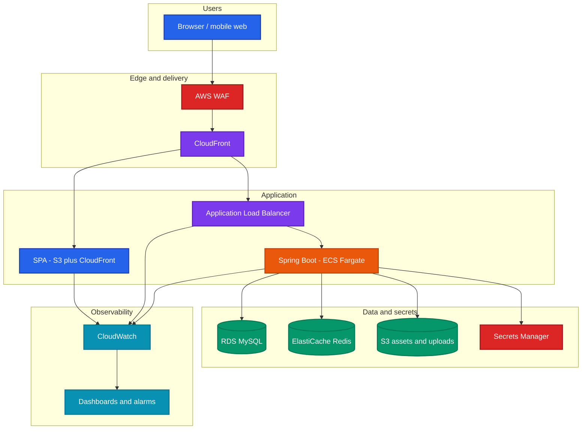
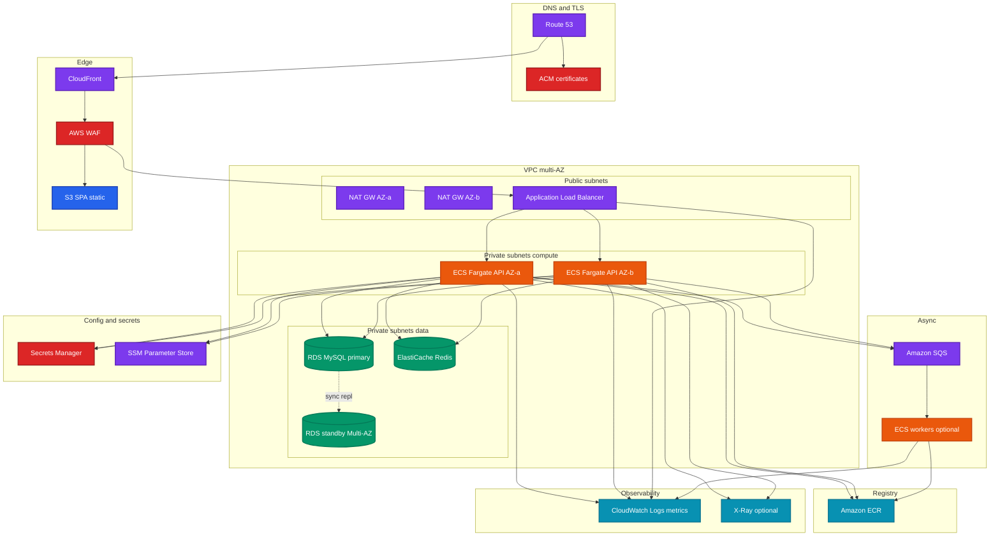
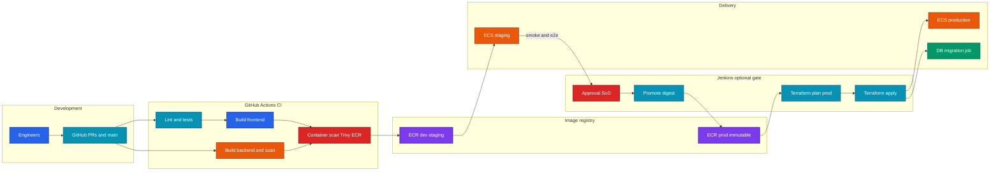
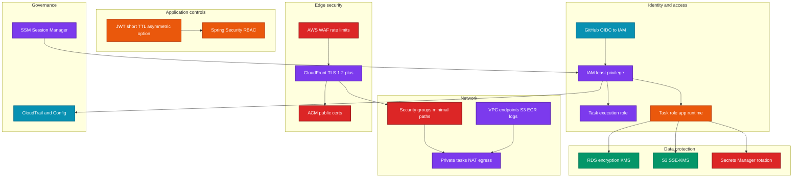
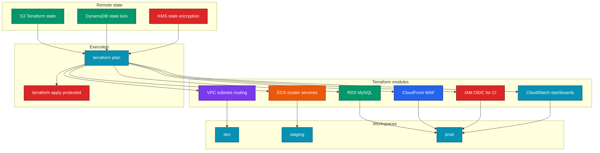

<div align="center">

# ExamWizards

### Cloud-native assessment and course platform

[](LICENSE)
[](https://spring.io/projects/spring-boot)
[](https://openjdk.org/)
[](https://react.dev/)
[](https://www.docker.com/)

**Backend-heavy SaaS architecture · Containerized services · AWS-oriented deployment design · IaC-ready**

[Architecture](#high-level-architecture) · [AWS design](#enterprise-aws-deployment-design) · [Infra layout](infra/README.md) · [Local setup](#local-development) · [License](#license)

</div>

---

ExamWizards is a **multi-tenant style, role-based educational platform** for online exams, course catalogs, enrollments, payments, and operations dashboards. The system is built around a **Spring Boot** domain API, a **React** SPA, and **MySQL**, with **Docker** as the primary packaging model and an **AWS-native target architecture** (ECS Fargate, RDS, edge delivery) designed for production scale.

The platform architecture was designed following **AWS Well-Architected** thinking—scalability, security, cost awareness, and operational maturity—while keeping the footprint appropriate for a **high-velocity product team**.

> **Deployment note:** Full-time public cloud hosting was disabled after validation to control cost. The **intended production topology** remains AWS container services with Terraform-driven infrastructure and CI/CD automation; lightweight demos may run on smaller hosts or Compose-only environments.

---

## Engineering highlights

| Area | What ships here |
|------|------------------|
| **Backend** | Spring Boot 2.7, Java 17, REST API, JPA/Hibernate, Spring Security, JWT, domain services (auth, courses, exams, enrollments, payments, reviews, admin) |
| **Frontend** | React 18, TypeScript, Vite, Tailwind, MUI, React Router v7, axios, role-guarded routing |
| **Data** | MySQL 8 (RDS-compatible); Flyway scripts present; Hibernate schema management in default config |
| **Containers** | Multi-stage Dockerfiles (backend, frontend), Compose stack, optional monolith-style image |
| **IaC** | **Terraform** in [`infra/aws/terraform`](infra/aws/terraform) (optional VPC module, ALB/ECS/RDS README stubs); Azure preview root in [`infra/azure/terraform`](infra/azure/terraform); [`terraform/README.md`](terraform/README.md) points to AWS |
| **CI/CD** | [`.github/workflows/ci.yml`](.github/workflows/ci.yml) — Maven, Vite build, Terraform fmt/validate; **[`Jenkinsfile`](Jenkinsfile)** — parameterized image build/push (Docker Hub or ECR path) |
| **AWS design** | ECS Fargate, ALB, RDS MySQL, ElastiCache Redis, CloudFront, Route 53, WAF, Secrets Manager, CloudWatch, SQS, ECR — aligned with [`ecs-task-definitions/`](ecs-task-definitions/) and [`deploy/`](deploy/) |
| **Security** | JWT + RBAC, BCrypt, email verification flows, private subnet pattern in cloud design, TLS at edge, least-privilege IAM for tasks |
| **Observability** | CloudWatch logs/metrics/alarms in target AWS design; file logging in Spring Boot |

---

## Features

### Students

- Course discovery, enrollment (free and paid via Razorpay), and progress surfaces  
- Timed exams, submissions, results, and leaderboard-style experiences  
- Profile and review flows where enabled  

### Instructors and administrators

- Course creation (visibility, pricing, metadata), exam lifecycle, and roster-style controls  
- Instructor dashboards and analytics-oriented endpoints  
- Admin dashboards, user management, contact requests, and review moderation  

### Platform engineering

- Stateless API suitable for horizontal scaling behind a load balancer  
- Structured REST surface (`/api/...`) consumed by a single SPA client  
- Optional **Node chatbot** service (`chatbot/`) for Gemini-backed assistance (separate process from the Spring monolith)  

### DevOps and infrastructure

- **Docker Compose** for local and demo multi-container runs  
- **Jenkins** pipeline for image build and registry delivery  
- **Terraform**-first mental model for AWS (documented target; add `terraform/` modules in your org fork if desired)  
- **ECR** as the container registry in the target pipeline  

---

## High-level architecture



---

## Enterprise AWS deployment design



---

## DevOps and CI/CD



**Repository state:** a root **`Jenkinsfile`** builds and pushes a Docker image to Docker Hub. **GitHub Actions** workflows are the recommended next step for automated PR checks, image scanning, and OIDC-based deploys—add them under `.github/workflows/` to match the diagram above.

---

## Security architecture



---

## Terraform and infrastructure provisioning



**Note:** Keep **remote state** in S3 with **DynamoDB** locking and **KMS** encryption; copy `infra/aws/terraform/backend.tf.example` after buckets exist (do not commit secrets in `terraform.tfvars`).

---

## Tech stack

| Layer | Technology |
|-------|------------|
| API | Spring Boot 2.7, Spring Web, Spring Security, Spring Data JPA, validation |
| Runtime | Java 17 |
| Database | MySQL 8 |
| Auth | JWT (Bearer), BCrypt, role-based authorization |
| Integrations | Razorpay, Gmail SMTP, Google Gemini (chatbot) |
| UI | React 18, TypeScript, Vite, Tailwind CSS, MUI, React Router 7 |
| HTTP client | axios |
| Containers | Docker, Docker Compose, Nginx (static and reverse proxy) |
| CI | GitHub Actions ([`.github/workflows/ci.yml`](.github/workflows/ci.yml)); Jenkins ([`Jenkinsfile`](Jenkinsfile)) |
| Cloud (target) | AWS ECS Fargate, ALB, RDS, ElastiCache, CloudFront, Route 53, WAF, Secrets Manager, CloudWatch, SQS, ECR |
| IaC | Terraform — [`infra/aws/terraform`](infra/aws/terraform), optional [`infra/azure/terraform`](infra/azure/terraform) |
| Preview UI | Vercel ([`frontend/vercel.json`](frontend/vercel.json)) |

---

## AWS deployment architecture (intended production)

| Service | Role |
|---------|------|
| **VPC** | Isolated network with public subnets (ALB, NAT) and private subnets (ECS tasks, RDS, Redis) |
| **ECS Fargate** | Stateless Spring Boot containers; horizontal scale on CPU/RPS |
| **ALB** | TLS termination toward clients, path routing, health checks |
| **RDS (MySQL)** | Managed relational data, Multi-AZ in production, automated backups |
| **ElastiCache (Redis)** | Cache, rate limits, idempotency, hot read paths |
| **S3** | SPA static assets, user uploads, exports |
| **CloudFront** | Global edge, caching, TLS, origin shielding for S3 and ALB |
| **Route 53** | DNS, health-checked failover patterns where needed |
| **ACM** | Public certificates for ALB and CloudFront |
| **WAF** | OWASP-oriented rules, rate limits, geo controls |
| **Secrets Manager** | DB credentials, JWT signing material, third-party API keys |
| **CloudWatch** | Logs, metrics, alarms, dashboards |
| **SQS** | Async email, webhooks, background jobs decoupled from request threads |
| **ECR** | Immutable image storage per environment |
| **IAM** | Task roles, CI OIDC roles, least privilege per workload |
| **GitHub Actions** | Lint, test, build, scan, push to ECR, trigger deploy |
| **Jenkins** | Optional approval gate, promote digest, Terraform plan/apply in regulated orgs |
| **Terraform** | Declarative VPC, ECS services, RDS, Redis, WAF associations, observability baselines |

---

## DevOps and CI/CD workflows (how it fits together)

1. **Docker images** — Multi-stage builds for `backend/` and `frontend/`; Compose orchestrates MySQL + API + SPA for local parity.  
2. **GitHub Actions (recommended)** — On each PR: install, lint, unit tests, build artifacts, container build, vulnerability scan, push to **ECR** with **OIDC** (no long-lived AWS keys).  
3. **Jenkins (included)** — `Jenkinsfile` demonstrates **docker.build** and **docker.push** to Docker Hub with credential binding; swap registry to ECR in production.  
4. **Terraform** — Plans and applies from a protected branch or tooling role; modules own VPC, ECS services, RDS subnet groups, security groups, and CloudFront + WAF wiring.  
5. **Promotion** — Immutable **image digest** from staging to production; database migrations run as a one-off ECS task or controlled job.  
6. **Deployment strategy** — Rolling or blue/green on ECS with ALB health checks; automatic rollback on failed steady state.

---

## Security and scalability

- **IAM** — Separate execution vs. task roles; narrow policies for RDS, S3 prefixes, SQS queues, and KMS keys.  
- **Network** — No public IPs on application tasks; egress via NAT or VPC endpoints for AWS APIs.  
- **WAF** — Edge protection in front of CloudFront and optionally ALB.  
- **Application** — JWT authentication, Spring Security **RBAC**, BCrypt passwords, email verification on registration flows.  
- **TLS** — Enforced at CloudFront and ALB; restrict CORS to real app origins in production.  
- **Secrets** — No secrets in Git; use **Secrets Manager** (and SSM Parameter Store for non-secret config) in AWS.  
- **Horizontal scale** — More Fargate tasks behind ALB; tune JDBC pool size vs. RDS `max_connections`.  
- **Async** — **SQS** for slow or bursty work (notifications, payment follow-up).  
- **Redis** — Offload session-adjacent or ephemeral data from MySQL where appropriate.

---

## Screenshots and demo

Add screenshots under `docs/screenshots/` (or your preferred path) and link them here.

```text
docs/screenshots/
  landing.png
  student-dashboard.png
  instructor-exams.png
  admin-users.png
```

Until assets exist, run **Docker Compose** locally and capture the above views for portfolio use.

---

## Local development

### Prerequisites

- JDK 17, Maven  
- Node.js 20 LTS  
- Docker Desktop (optional but recommended)  
- MySQL 8 (or use Compose for the database only)

### Frontend

```bash
cd frontend
npm ci
npm run dev
```

Configure `VITE_API_BASE_URL` (e.g. `http://localhost:8080/api`) for API calls. For **Vercel** previews, set the same variable in the project settings to your preview API base URL; see [`frontend/vercel.json`](frontend/vercel.json).

### Backend

```bash
cd backend
./mvnw.cmd test   # Windows
# ./mvnw test     # Unix
./mvnw.cmd spring-boot:run
```

Set `DB_URL`, `DB_USERNAME`, `DB_PASSWORD`, and integration keys per `.env.example`.

### Docker (full stack)

```bash
cp .env.example .env
# Edit .env

docker compose up -d
```

Services: MySQL on **3306**, API on **8080**, SPA on **3000** (see `docker-compose.yml`).

### Environment variables

See **`.env.example`** for database, email (SMTP), Razorpay, Gemini, and JWT-related placeholders.

### Database

- Compose provisions schema via application startup (Hibernate `ddl-auto` in default properties).  
- For production, prefer **explicit migrations** (Flyway/Liquibase) against **RDS**, with backups and rollback strategy.

---

## Deployment

**Production (AWS-first):** Build immutable API images to **Amazon ECR**, run **ECS Fargate** behind an **ALB**, terminate TLS with **ACM**, edge-cache and protect with **CloudFront** and **AWS WAF**, persist data in **RDS for MySQL**, use **ElastiCache (Redis)** and **SQS** where async and cache patterns apply, inject secrets from **Secrets Manager**, and observe with **CloudWatch**. **Terraform** under [`infra/aws/terraform`](infra/aws/terraform) is the intended provisioning root (VPC module is **off by default** via `enable_vpc` to avoid accidental cost).

**CI/CD:** [`.github/workflows/ci.yml`](.github/workflows/ci.yml) runs Maven, frontend build, and `terraform fmt` / `validate`. [`.github/workflows/terraform-plan-aws.yml`](.github/workflows/terraform-plan-aws.yml) runs **`terraform plan`** on PRs that touch AWS Terraform when repository variable **`TF_AWS_ROLE_ARN`** is configured ([OIDC setup](infra/aws/docs/github-oidc-for-actions.md)). [`Jenkinsfile`](Jenkinsfile) supports parameterized **Docker Hub vs ECR** push and optional approval gates—wire your agents, credentials, and scanners to match your org.

**Preview (cost-efficient):** [`infra/azure/terraform`](infra/azure/terraform) provisions **nothing** until `enable_azure = "true"`—suitable for optional **Azure Container Apps** / **App Service** style previews. [`frontend/vercel.json`](frontend/vercel.json) configures **Vercel** for the SPA; set **`VITE_API_BASE_URL`** in the Vercel project to your preview API (Azure, tunnel, or shared dev ALB). Preview paths **do not replace** the AWS production design.

**Also in repo:** Root **`docker-compose.yml`**, per-service **Dockerfiles**, sample **`deployment/`** / **`services/`** Kubernetes manifests for experiments—not a substitute for a fully applied AWS account.

**Local-only docs:** Optional material can live in **`files/`** (gitignored); it is not published with this repository.

| Area | Location |
|------|----------|
| AWS Terraform | [`infra/aws/terraform`](infra/aws/terraform) |
| Azure preview Terraform | [`infra/azure/terraform`](infra/azure/terraform) |
| Terraform pointer | [`terraform/README.md`](terraform/README.md) |
| ECS task JSON | [`ecs-task-definitions/`](ecs-task-definitions/) |
| Deploy runbooks & ECR example | [`deploy/`](deploy/) |
| Nginx examples | [`nginx/`](nginx/) |
| Production Docker notes | [`docker/production/`](docker/production/) |
| Monitoring / observability docs | [`monitoring/`](monitoring/), [`observability/`](observability/) |
| Scripts index | [`scripts/`](scripts/) |
| Infra index | [`infra/README.md`](infra/README.md) |
| GitHub OIDC (Terraform plan) | [`infra/aws/docs/github-oidc-for-actions.md`](infra/aws/docs/github-oidc-for-actions.md) |

---

## Project structure

```text
Examwizards-Platform/
├── .github/workflows/       CI + optional Terraform plan on PR (AWS OIDC)
├── backend/                 Spring Boot API, Dockerfile, Flyway SQL (optional runtime)
├── frontend/                React SPA, Vite, Dockerfile, nginx, vercel.json (preview)
├── chatbot/                 Optional Express + Gemini service
├── infra/
│   ├── README.md            Infra index (AWS primary, Azure preview)
│   ├── aws/
│   │   ├── docs/            GitHub OIDC + Terraform PR plan docs
│   │   └── terraform/       VPC & ECS cluster (optional flags), ALB/RDS README stubs
│   └── azure/terraform/     Preview-only stack (disabled by default)
├── terraform/               Pointer to infra/aws/terraform
├── ecs-task-definitions/    Fargate task definition templates
├── deploy/                  Runbooks, ECR push example script
├── nginx/                   Nginx snippets + docs (ALB/CloudFront remain primary on AWS)
├── docker/production/       Production hardening notes for images
├── monitoring/              CloudWatch alarm / dashboard guidance
├── observability/           Logs, metrics, tracing notes
├── scripts/                 Script index (ECR helper lives under deploy/scripts)
├── deployment/              Sample Kubernetes Deployment manifest
├── services/                Sample Kubernetes Service manifest
├── files/                   (local only — gitignored) optional extended docs
├── docker-compose.yml       Local multi-container stack
├── Dockerfile               Monolith-style demo image (nginx + JAR)
├── Jenkinsfile              Parameterized build / push pipeline
├── nginx.conf               Root monolith reverse proxy sample
├── .env.example             Environment template
├── .env.template            Copy-to-.env template
├── LICENSE                  Source-available proprietary license
└── README.md
```

---

## Roadmap

| Theme | Direction |
|-------|-----------|
| **Observability** | OpenTelemetry traces, structured JSON logs, SLO-based alerts |
| **Orchestration** | Evaluate **EKS** if team needs Kubernetes-native tooling and multi-cluster patterns |
| **Analytics** | Warehouse export (e.g. S3 + Athena), event bus for product analytics |
| **Integrity** | Optional AI-assisted proctoring and anomaly detection (privacy reviewed) |
| **Resilience** | Multi-region passive stack, Route 53 failover, cross-region RDS snapshot strategy |
| **Events** | Domain events to SNS/SQS/Kinesis for decoupled consumers |

---

## Professional deployment note

The platform architecture was designed following **AWS Well-Architected** principles with emphasis on **scalability**, **security**, **cost optimization**, and **cloud-native operational maturity**—while keeping the shipping system understandable for a small, senior team.

---

## License

This project is **source-available** and **proprietary**. You may **view** the code for personal or educational reference. **Commercial use**, **redistribution**, and **unauthorized modification or resale** are **not permitted** without **written permission** from the copyright holder.

See **[LICENSE](LICENSE)** for full terms.

**Copyright (c) 2026 Abhijeet Rane.** All rights reserved.

---

## Author

**Abhijeet Rane**  
Docker Hub: [@abhijeetrane204](https://hub.docker.com/u/abhijeetrane204) · Email: [abhijeetrane204@gmail.com](mailto:abhijeetrane204@gmail.com)

---

## Acknowledgments

Built with Spring Boot, React, Docker, and the broader open-source ecosystem. Third-party components remain under their respective licenses.
